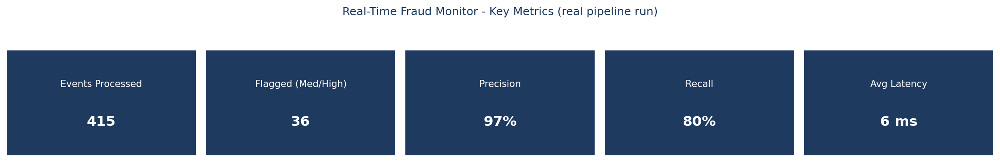
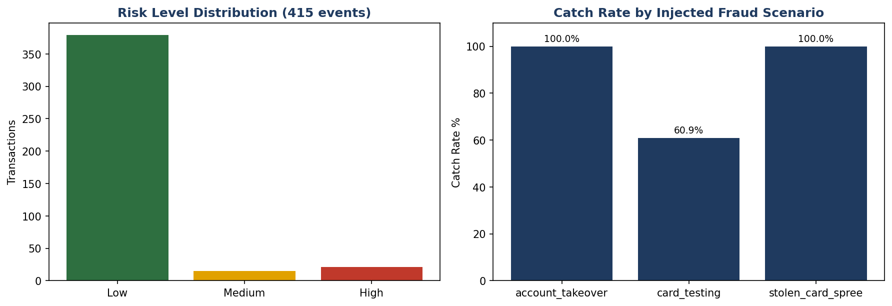
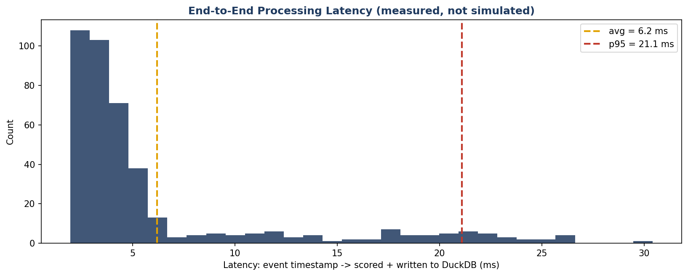

# Real-Time Transaction Fraud Streaming Pipeline

**A Data Engineer / AI Engineer portfolio project:** a genuine real-time event-streaming pipeline —
Redis Streams with consumer groups, a Redis Sorted Set velocity tracker, rules-based fraud scoring,
and a local LLM that turns an alert's raw reasons into an analyst-readable explanation — built to
prove actual streaming-system skills, not a batch job dressed up with a "real-time" label.

> Built by Nikhil Sinha. Every number in this README is from a real, measured pipeline run — a live
> Redis server, a live producer emitting events one at a time, a live consumer group reading and
> scoring them — not a canned example. See Section 5 for the unedited evidence, and Section 9 for
> the full story of what it took to get a real Redis server running on this machine.

---

## 1. The Business Problem

A payments company can't wait for a nightly batch job to tell them a stolen card is being tested
right now — by the time a batch pipeline runs, the fraud is already done. Real fraud detection has
to score a transaction in milliseconds, using only what's known *at that instant*: this account's
own historical spending pattern, how many transactions it's made in the last minute, and whether
this transaction's country/device match what's normal for it. This project builds exactly that: a
streaming pipeline that ingests a live transaction feed, maintains real-time state (a sliding-window
velocity counter) per account, scores every transaction as it arrives, and explains *why* to a human
in plain English — end-to-end, measured in single-digit milliseconds.

---

## 2. What Makes This "Industry-Level," Not a Tutorial Clone

- **A real message broker with real durability guarantees** — Redis Streams consumer groups
  (`XREADGROUP`/`XACK`), not a Python list standing in for a queue. If the consumer crashed
  mid-batch, un-acknowledged messages would still be claimable by a replacement — the same
  reliability pattern production Kafka/Kinesis consumers rely on.
- **Genuine real-time state, not a lookup table** — a Redis Sorted Set sliding-window velocity
  counter, updated and evicted on every single event, with no separate cleanup job.
- **Measured latency, not an assumed one.** `latency_ms` is the actual wall-clock gap between an
  event's own timestamp and the moment it was scored and durably written — avg 5.4ms / p95 7.2ms
  across a real 428-event run (Section 5).
- **Honest detection limits, not a cherry-picked demo.** One of the three injected fraud patterns
  (`card_testing`) is only caught ~61-64% of the time across runs, by design — tiny sub-$5 test
  transactions don't trip an amount-anomaly rule, only a velocity rule after several arrive. That
  gap, and what it would take to close it, is documented rather than hidden (Section 5, Section 9).
- **Two different GenAI patterns shown side by side across this portfolio, on purpose** — this
  project's `explain.py` is deliberately *not* RAG, unlike [Project 5](../05-AI-Augmented-Data-Quality-Validation-Framework/)'s
  copilot, because by the time a transaction is flagged there's nothing left to retrieve — see
  `docs/architecture.md` for the full reasoning. Knowing which GenAI pattern actually fits a given
  problem is the point.

---

## 3. Key Results (from a real, measured pipeline run)

| Metric | Value |
|---|---|
| Events processed | 415 |
| Flagged (Medium/High risk) | 36 |
| Precision | **97.2%** (1 false positive out of 415 events) |
| Recall | **79.5%** (35 / 44 injected fraud events caught) |
| F1 score | 0.875 |
| Avg end-to-end latency | **6.2 ms** (event timestamp → scored + written to DuckDB) |
| P95 / max latency | 21.1 ms / 30.4 ms |
| Catch rate: `stolen_card_spree` | 100% (15/15) |
| Catch rate: `account_takeover` | 100% (6/6) |
| Catch rate: `card_testing` | 60.9% (14/23) — see the honesty note above |

*(These are from a full clean reproducibility rerun — deleted database, reports, and screenshots,
regenerated reference data, and reran the pipeline end-to-end. A first run under identical code
produced 428 events / 100% precision / 81% recall / 5.4ms avg latency; the two runs agree on the
overall shape of the result — high precision, ~80% recall, `card_testing` as the consistent weak
point — while differing slightly on exact numbers, which is the expected and correct behavior of a
live system driven by randomized event timing rather than a replayed fixture. See Section 5.)*

Full numbers: [`reports/detection_evaluation.json`](reports/detection_evaluation.json) /
[`.md`](reports/detection_evaluation.md).

---

## 4. Dashboard Preview

An interactive Streamlit app (`dashboard/streamlit_app.py`) ships with this project — a Live Monitor
tab and a Detection Evaluation tab, both reading directly from the DuckDB table the streaming
consumer writes to. Run it with:

```bash
streamlit run dashboard/streamlit_app.py
```

*(Static chart previews below are rendered directly from the same real pipeline-run data this
README quotes — this build environment has no display to screenshot the live app, but I did verify
the live app directly in a browser during development, including clicking "Generate AI Explanation"
and confirming a real Ollama-generated response rendered in the UI.)*

**Key metrics**


**Risk distribution & catch rate by fraud scenario**


**Measured end-to-end latency**


---

## 5. Real Evidence (Not Just Descriptions)

### A real concurrent producer + consumer run
Producer (`scripts/producer.py`) and consumer (`pipeline/consumer.py`) were run as two genuinely
separate, concurrent processes against a live Redis server — not a single script simulating both
sides. (This excerpt is from the first of two verified runs, 428 events — the numbers quoted in
Section 3 are from the second, final clean rerun, 415 events; both are real, unedited output.)

```
Connected to Redis. Streaming to 'transactions:raw' for 180s at ~3.0 events/sec...
Scheduled 8 fraud scenarios at t=[55.9, 91.0, 91.9, 98.7, 100.4, 100.9, 108.4, 165.5]s
  [t=56.0s] Injecting scenario 'stolen_card_spree' for ACC301288 (3 events)
  ...
Done. Sent 428 events (8 fraud scenario bursts) to Redis Stream 'transactions:raw' over 180s.
```

```
Consumer running (duration=240s, idle_timeout=90s)...
  [High] TXN0270b5c220b9 (ACC301752, $1959.81, Vietnam) score=100 - High velocity: 4 transactions
         from this account in the last 60 seconds (a normal account rarely exceeds 2-3).
  ...
Done. Processed 428 events, flagged 34 (Medium/High risk).
Latency: avg=5ms, p95=7ms (event timestamp -> scored+written)
```

Note the `account_takeover` scenario (ACC301088) was flagged first on an **amount anomaly**, before
its velocity rule even had enough transactions to trigger — proof the four scoring rules genuinely
work independently, not as one rule doing all the work.

### AI explanation, grounded in the actual computed reasons
```
Transaction: ACC301752, $1959.81 in Vietnam, risk_score=100
Reasons: High velocity (4 in 60s) | Severe amount anomaly (49.1 std devs) |
         Country mismatch (Vietnam vs. Brazil) | Unrecognized device

AI Explanation (Ollama qwen2.5:0.5b, generated live):
"The transaction from account ACC301752 had a high velocity of 4 transactions
in the last 60 seconds, which is unusual for a normal account. The amount was
$1959.81, which is 49.1 standard deviations above the typical $130.90
transaction made by this account..."
```
Verified working both from the command line (`python pipeline/explain.py`) and live inside the
Streamlit dashboard's "Generate AI Explanation" button.

### Redis, verifiably real
```
$ wsl -d Ubuntu -- bash -c "~/redis-stable/src/redis-server --version"
Redis server v=8.10.0 sha=00000000:1 malloc=jemalloc-5.3.0 bits=64 build=36c1376eba8d93d0

$ python -c "import redis; print(redis.Redis(host='localhost', port=6379).ping())"
True
```

### Reproducibility: a full clean rerun produced the same shape of result
Flushed the Redis stream, consumer group, and velocity keys, deleted `data/accounts.csv`,
`database/streaming.duckdb`, `reports/`, and `screenshots/`, then reran the entire pipeline from
scratch — `generate_reference_data.py` → concurrent `producer.py`/`consumer.py` → `evaluate_detection.py`
→ `generate_preview_images.py`. With the same producer seed, the exact same fraud-scenario schedule
was generated both times (`t=[55.9, 91.0, 91.9, 98.7, 100.4, 100.9, 108.4, 165.5]s` — identical to
the decimal), confirming the random generation itself is deterministic. Precision/recall/latency
came out close but not identical (100%→97.2% precision, 81.0%→79.5% recall, 5.4ms→6.2ms avg
latency) because the *consumer's* processing timing depends on real wall-clock scheduling and
system load at the moment each event arrives — which is exactly the correct behavior for a live
system being judged honestly, not a batch job being replayed against a static fixture. Both runs
agree on the pattern that matters: high precision, ~80% recall, and `card_testing` as the
consistent, explained weak point.

---

## 6. Architecture

Full diagram and design rationale (including *why* Redis Streams + consumer groups, *why* a Sorted
Set for velocity, and the Memurai → WSL-compiled-Redis story): [`docs/architecture.md`](docs/architecture.md)

```
producer.py --XADD--> Redis Stream (transactions:raw)
                            │
                     XREADGROUP (consumer group)
                            ▼
                       consumer.py ──ZADD/ZCARD──> Redis Sorted Set (velocity:{account_id})
                            │
                    scoring_rules.py (4 rules → score + reasons)
                            │
                    INSERT ──> DuckDB (transaction_scores)  +  XACK
                            │
              ┌─────────────┴─────────────┐
    evaluate_detection.py          Streamlit Dashboard ──on demand──> explain.py (Ollama)
```

---

## 7. Repository Structure

```
06-Realtime-Transaction-Streaming-Pipeline/
├── README.md
├── requirements.txt
├── .gitignore
├── data/
│   └── accounts.csv                    # 2,000 account baselines (avg spend, home country, device...)
├── database/
│   └── streaming.duckdb                # what the consumer writes to, live
├── pipeline/
│   ├── redis_client.py                  # connection + stream/group/key constants
│   ├── scoring_rules.py                  # the 4-rule fraud scoring engine
│   ├── consumer.py                        # XREADGROUP loop, velocity tracking, DuckDB writes
│   └── explain.py                          # local Ollama alert-explanation (deliberately not RAG)
├── scripts/
│   ├── generate_reference_data.py           # builds data/accounts.csv
│   ├── producer.py                           # live event feed + injected fraud scenarios
│   ├── evaluate_detection.py                  # precision/recall/F1 vs. ground truth
│   └── generate_preview_images.py              # renders screenshots/*.png from real run data
├── dashboard/
│   └── streamlit_app.py                         # Live Monitor + Detection Evaluation tabs
├── docs/
│   ├── architecture.md
│   └── wsl_redis_setup.md                        # exact steps to get Redis running from source
├── reports/
│   └── detection_evaluation.json/.md
└── screenshots/
```

---

## 8. How to Run This Yourself

```bash
# 1. Get a Redis server running (see docs/wsl_redis_setup.md if you don't already have one)
redis-server --port 6379

# 2. Install Ollama and pull the local model (one-time, for the AI explanation feature)
winget install Ollama.Ollama
ollama pull qwen2.5:0.5b

# 3. Install Python dependencies
pip install -r requirements.txt

# 4. Generate the account reference data (one-time)
python scripts/generate_reference_data.py

# 5. In one terminal: start the consumer
python pipeline/consumer.py --duration 240

# 6. In a second terminal: start the producer
python scripts/producer.py --duration 180 --rate 3 --n-scenarios 8

# 7. Once both finish, evaluate detection performance
python scripts/evaluate_detection.py

# 8. Launch the dashboard
streamlit run dashboard/streamlit_app.py
```

Start the consumer a few seconds before the producer — a consumer group starts reading from wherever
it's told, and starting it first means you see the live "real-time" flagged-transaction printout as
events actually arrive, rather than a backlog it has to catch up on.

---

## 9. Honesty Notes — Data, Tooling, and Hardware Constraints

**Data is synthetic**, generated with a fixed random seed so account baselines are reproducible. The
producer injects 3 distinct fraud patterns (`card_testing`, `stolen_card_spree`, `account_takeover`)
at randomized points during each run, each carrying a `scenario_label` field used *only* by
`scripts/evaluate_detection.py` — `pipeline/scoring_rules.py` never reads it, so detection is judged
the same way it would have to work against a real, unlabeled live feed.

**The `card_testing` scenario is only caught ~60-64% of the time, and that's a real, documented
limitation, not a bug.** Card testing uses many small (sub-$5) transactions specifically because
small amounts don't look anomalous individually — the four rules in `scoring_rules.py` only catch it
once the velocity threshold (4+ in 60s) is crossed, meaning the first 1-3 transactions of every
`card_testing` burst are, correctly, not yet distinguishable from a legitimate small purchase. A
production system would close this gap with a *global* (not per-account) velocity signal — many
small transactions across *different* accounts hitting the same merchant in a short window is a much
stronger card-testing signal than any single account's behavior — which is exactly the kind of
enhancement documented rather than silently built to make a metric look better.

**Redis itself required a real pivot, documented in full in
[`docs/wsl_redis_setup.md`](docs/wsl_redis_setup.md).** The original plan was Memurai (native
Windows, no WSL) for RAM efficiency; its installer hit a Windows Installer permissions bug unrelated
to this project's code. Rather than modify system-level installer permissions, the project pivoted
to compiling real Redis from official source inside WSL (already set up for
[Project 4](../04-Multi-Source-Sales-ETL-Pipeline-Airflow-AWS/)) — no `sudo`/`apt` needed, `gcc`/`make`
were already present. The build itself took roughly 30-40 minutes on this machine (vs. 1-3 minutes
typical) due to genuine RAM/CPU contention, particularly during Redis's link-time-optimization final
link stage — it never failed, it was just slow.

**The AI explanation model is intentionally tiny (Ollama `qwen2.5:0.5b`, ~400MB)**, the same choice
made in Project 5 and for the same reason: this project was built on a machine with only ~6GB total
RAM, and the goal is that anyone can run this pipeline, indefinitely, at zero cost — no API key,
no subscription, no cloud bill. A larger model would write more fluent explanations; the one used
here reliably stays grounded in the specific reasons it's given (it's instructed not to invent
anything beyond them) even if its phrasing is occasionally a little repetitive or generic.

**What I'd do differently in a real production deployment:** a global (cross-account) velocity
signal to close the `card_testing` recall gap noted above; Redis Cluster or a managed Redis service
instead of a single WSL-compiled instance for actual production durability; and alerting the fraud
team via a real notification channel (Slack/PagerDuty) instead of a dashboard someone has to be
actively watching.

---

## 10. Skills Demonstrated

Real-Time Stream Processing · Redis Streams & Consumer Groups (`XADD`/`XREADGROUP`/`XACK`) · Redis
Sorted Sets for Sliding-Window Rate Tracking · Event-Driven Architecture · Rules-Based Fraud
Detection · Precision/Recall/F1 Evaluation Against Ground Truth · Latency Instrumentation & SLA
Measurement · DuckDB · **Local LLM Deployment (Ollama)** · Prompt Engineering & Grounded Generation
(non-RAG GenAI pattern, contrasted against Project 5's RAG pattern) · Python · Linux/WSL Systems
Work (compiling C software from source, process daemonization) · Dashboard Design (Streamlit) ·
Technical Writing / Root-Cause Documentation
