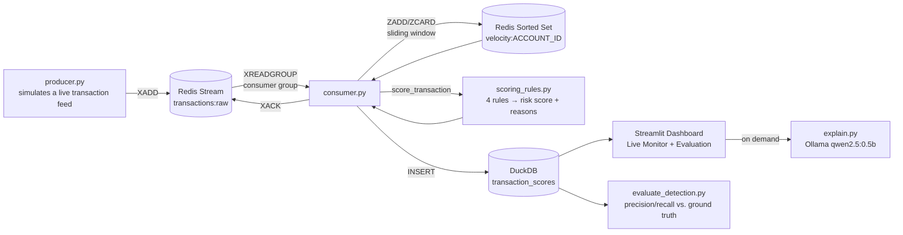

# Architecture

## Pipeline flow

## Why Redis Streams + consumer groups, not a naive list/pub-sub

A naive approach (`LPUSH`/`RPOP`, or plain pub-sub) either loses messages if no consumer is listening
at the moment they're published, or gives no way to track "did this specific message actually get
processed" if the consumer crashes mid-batch. **Consumer groups** (`XGROUP CREATE`, `XREADGROUP`,
`XACK`) solve both: the stream itself is a durable, append-only log (new consumers can join and
read from the beginning), and every message is only removed from the "pending" list once explicitly
acknowledged - so a crashed consumer's un-ACKed messages remain claimable by a replacement, instead
of silently vanishing. This is the same reliability pattern real production Kafka/Kinesis consumers
rely on, expressed through Redis's simpler primitive.

## Why a Redis Sorted Set for velocity tracking, not a separate counter service

`ZADD velocity:{account_id} {timestamp} {event_id}` followed by `ZREMRANGEBYSCORE` (evict anything
older than the 60-second window) and `ZCARD` (count what's left) is a standard, idiomatic Redis
pattern for sliding-window rate limiting - and it's genuinely real-time-safe: the eviction happens
on every write, so the count is always accurate as of "right now," with no separate cleanup job
needed. This is the same technique real fraud/rate-limiting systems use in production.

## Two different GenAI patterns across this portfolio, on purpose

Project 5's AI Data Quality Copilot is a **RAG** system - it retrieves relevant documents from a
knowledge base because the right answer to "why did this fail?" could live in any of dozens of test
results, and the system doesn't know which ones matter until the question is asked.

This project's `explain.py` is deliberately **not** RAG. By the time a transaction is flagged, the
exact reasons are already fully known and computed - `scoring_rules.py` produced them as plain
factual strings. There is nothing to *retrieve*; the LLM's only job is turning a bullet list into a
sentence a human reads faster, with a suggested next action. Building a full retrieval pipeline here
would have been unnecessary complexity solving a problem that doesn't exist in this project. Knowing
which GenAI pattern actually fits a given problem - rather than defaulting to RAG everywhere because
it worked once - is the point of showing both approaches side by side across this portfolio.

## Getting Redis running on this machine: what actually happened

The RAM-friendlier plan was **Memurai** (a native-Windows, Redis-compatible server, no WSL needed).
`winget install Memurai.MemuraiDeveloper` downloaded and verified correctly, but its installer's
`ca_SilentCheckIfPortIsAvailable` custom action failed with `SFXCA: Failed to create temp directory.
Error code 5` (Access Denied) - a Windows Installer/custom-action permissions issue unrelated to
disk space, RAM, or anything this project controls. Rather than chase system-level installer
permissions, the project pivoted to compiling **real Redis** from its official source
(`download.redis.io/redis-stable.tar.gz`) inside the WSL environment already set up for Project 4 -
`gcc`/`make` were already present, no `sudo`/`apt` needed. Full steps:
[`docs/wsl_redis_setup.md`](wsl_redis_setup.md).

## Data model

`transaction_scores` (DuckDB) carries the full audit trail per transaction: the raw event fields,
the computed velocity count at scoring time, the risk score/level, the **plain-English reasons**
(so no downstream consumer has to re-derive "why" from raw numbers), the measured processing
latency, and the `scenario_label` ground-truth tag used only by the evaluation script - never by
the scoring logic itself.
